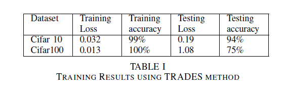
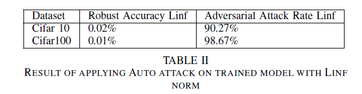
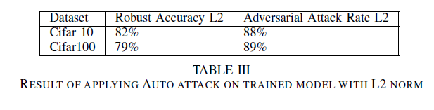
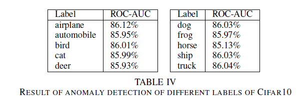

# Adversarial-Robustness-in-Computer-Vision
This repository contains code and documentation for a project focused on assessing the robustness of computer vision models against adversarial attacks. The project utilizes the Resnet-18 architecture, Cifar10, and Cifar100 datasets, exploring auto attacks, adversarial training, and an anomaly detection algorithm.

## Abstract

The reliability of computer vision models is crucial for practical applications. However, they can be compromised by adversarial attacks—subtle perturbations to input images that may go unnoticed by the human eye. This project focuses on training the ResNet-18 model using CIFAR-10 and CIFAR-100 datasets, evaluating its accuracy, and testing its robustness against adversarial attacks. With the application of anomaly detection algorithms and state-of-the-art adversarial training methods, we aim to improve the security measures of these models in practical applications.

## Introduction

Deep learning, particularly in computer vision, has achieved high accuracy rates in classification tasks. Despite this, models are vulnerable to adversarial attacks, which can lead to incorrect outcomes. In response to the growing number of such attacks, our project explores auto attack adversarial algorithms and develops an effective anomaly detection algorithm to identify malicious samples. We also investigate the effectiveness of two adversarial training algorithms and propose an ensemble model that enhances robustness with minimal accuracy trade-offs.

## Repository Structure
- training/: Code for training Resnet-18 on CIFAR-10 and CIFAR-100 datasets using TRADES and adversarial training.
- Auto_attack_and_Anomaly_detection/: Implementation of the auto attack algorithm and the anomaly detection algorithm..

## Results

## Acknowledgments

* [ResNet-18 Architecture](https://arxiv.org/abs/1512.03385)
* [AutoAttack Algorithm](https://arxiv.org/abs/2003.01690)
* [Mean-Shifted Contrastive Loss for Anomaly Detection](https://arxiv.org/abs/2003.09338)
* [TRADES: A Defense Against Adversarial Examples](https://arxiv.org/abs/1901.08573)
* [Ensemble Adversarial Training: Attacks and Defenses](https://arxiv.org/abs/1705.07204)